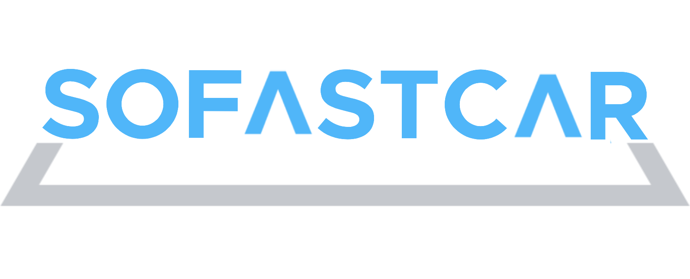

# Readme

## SOFASTCAR - Backend API

---

카셰어링 서비스 [SOCAR](https://www.socar.kr/) 의 백엔드 클론 프로젝트 입니다.

## Architecture

---

### Server

- Amazon EC2 - ubuntu 18.04.5 LTS

### Language

- python  3.7.5

### Framework

- Django-RestFramework 3.11

### Deploy

- production : gunicorn
- docker 사용, python 코드 배포 자동화

### Database

- AWS RDS PostgresSQL 12.3-R1

### Storage(StaticFiles)

- Amazon S3

## Tools

---

- Slack
- Google Meet, Hang out
- Drow.io
- Pycharm
- Trello
- Sentry

## 1차 스프린트 (2020.09.03 ~ 18)

## 2차 스프린트 (2020.09.19 ~ 10.08)
- 팀 구성원의 변경
- 1차 스프린트 미완성분에 대한 보완, 모델 재설계 작업

### MVP development

  
  
  
  

### 결과(영상)
- [로그인, 회원가입](https://youtu.be/W0kjmeD3b3g)
- [메인, 예약](https://youtu.be/RbDSDtoGo4E)
- [사용, 반납](https://youtu.be/wYxdN_Lp_Cs)
- [ARDUINO-리모콘 작동](https://youtu.be/7x6H_rOHzQA)
- [Sidebar](https://youtu.be/IRi1NMKAUaA)

